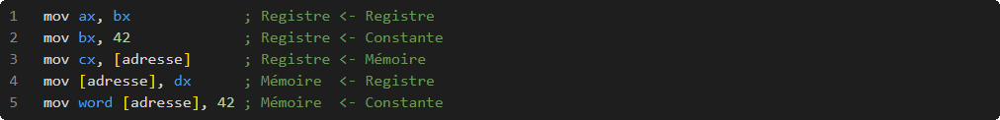
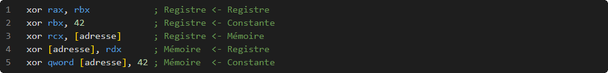

Bien qu’il soit beaucoup plus facile d’écrire un programme en langage assembleur plutôt qu’en langage machine, le travail reste fastidieux, sujet aux erreurs, et tout de même réservé aux programmeurs expérimentés puisqu’il nécessite de bonnes connaissances de la machine et de ses rouages internes.

# Historique

Ingénieur électrique, diplômé du MIT en 1941, Nathaniel Rochester commence à travailler chez IBM en 1948 afin de concevoir l’un des premiers ordinateurs polyvalent. Et c’est en 1954 qu’il écrit le premier programme en Assembleur pour l’IBM 701.

# Source

Le code source d'un programme en langage Assembleur est stocké dans des fichiers textes ayant, habituellement, « .asm » comme extension.

## Syntaxe

Exceptionnellement, deux syntaxes différentes sont utilisées pour le langage Assembleur.

Ayant été conçu dans les laboratoires Bell de AT&T, c'est le titre qui est donné à la première syntaxe. Le compilateur étant plus rudimentaire, cette syntaxe est un peu plus complexe.

Avec la venue des premiers ordinateurs personnels par Intel, c'est ce titre qui est donné à la deuxième syntaxe. Les compilateurs étant un peu plus évolués, la syntaxe a été simplifiée pour la rendre un peu plus intuitive.

C'est cette dernière qui sera utilisée pour dans les références ci-dessous.

## Commentaire

Contre intuitif avec la syntaxe de langages de plus haut niveau, le point-virgule permet de mettre en commentaire tout ce qui suit:

## Bloc

...

# Instructions

Le processeur ne fait pas que contenir des registres, son utilité principale est d'exécuter des instructions.

## MOV

L’architecture x64 permet d’affecter un registre ou un espace en mémoire centrale d’un autre registre ou d’un autre espace en mémoire centrale ou d’une constante.

## XOR

L’architecture x64 permet d’effectuer des opérations logiques entre un registre ou un espace en mémoire centrale et un autre registre ou un autre espace en mémoire centrale ou une constante.

## PUSH

L’architecture x64 permet d'empiler la valeur d'un registre, d'une constante ou d'un espace en mémoire centrale.

*Le registre « SP » est décrémenté lors de chaque empilement.*

## POP

L’architecture x64 permet de dépiler la valeur dans un registre ou un espace en mémoire centrale.

*[Image]*

*Le registre « SP » est incrémenté lors de chaque dépilement.*

*[Image]*

## CALL

L’architecture x64 permet d'appeler des fonctions:

*[Image]*

Cette instruction effectue deux opérations :

- Empilement de l'adresse contenue dans le registre « ip ».
- Affectation du registre « ip » par l'adresse de la fonction.

## RET

Une fonction se termine par l'instruction « ret »:

*[Image]*

Cette instruction effectue une opération :

- Dépilement dans le registre « ip ».