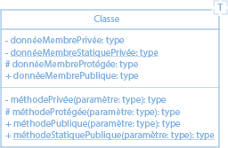
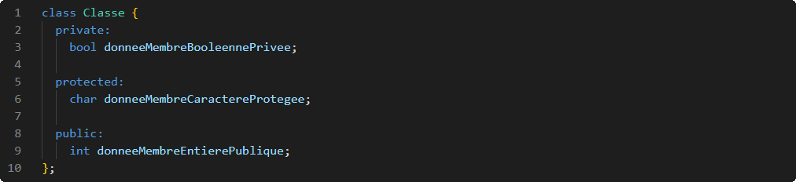

Évolution du langage C, ajoutant principalement la prise en charge du paradigme orienté objet.

# Historique

En 1979, Bjarne Stroustrup travaille à son doctorat et trouve de nombreuses fonctionnalités intéressantes au langage Simula. Mais il n’était pas aussi performant que le langage C, qui lui, était de trop bas niveaux.

 

En 1980, dans les laboratoires Bell d'AT&T, Stroustrup commence à améliorer le langage C en lui ajoutant la prise en charge de classe, de dérivation, du polymorphisme, etc. Bref, en lui faisant supporter le paradigme orienté objet. D’ailleurs, son nom de code était : « C with classes » mais, en 1983, il fut nommé « C++ », faisant un clin d’oeil à la syntaxe du langage.

> Il est facile de se tirer dans le pied avec le langage C; c’est plus difficile avec le langage C++ mais, lorsque vous y arrivez, c’est la jambe en entier qui explose.
>
> \- Bjarne Stroustrup

# Classe

Les classes sont les entités de bases du paradigme orienté objet.

## U.M.L.

La notation UML permet de visualiser rapidement et simplement la déclaration d'une classe:

## Déclaration

Le mot-clé « class » permet de déclarer une classe avec l'identificateur de notre choix:

### Modificateurs d'accès

Les modificateurs d'accès permettent de rendre une classe robuste en limitant l'accès aux membres sensibles:

| Accès   | Symbole | Description                                                     |
|---------|:-------:|-----------------------------------------------------------------|
|private  |    -    | Accessible que de l'implémentation de la classe.                |
|protected|    #    | Accessible des implémentations de la classe et de ses dérivées. |
|public   |    +    | Accessible de l'implémentation de la classe et de ses instances.|

Un modificateur d'accès s'applique à tout ce qui le suit:

*« private » est appliqué par défaut si aucun modificateur d'accès n'est déclaré.*

### Données membres

On nomme « donnée membre » les variables déclarées à l'intérieur d'une classe:

### Méthodes

On nomme « méthode » les fonctions déclarées à l'intérieur d'une classe:

## Implémentation

L'implémentation d'une classe peut se faire à l'intérieur comme à l'extérieur de son bloc de code.

### Constructeur

Méthode particulière puisqu'elle est appelée automatiquement lors de l'instanciation.

Puisqu'il s'agit d'une méthode que le compilateur doit différencier des autres méthodes, sa syntaxe comporte quelques exigences:

- Aucun type de retour
- Même identificateur que la classe

Le constructeur est principalement utilisé pour initialiser les données membres:

#### Défaut

S'il n'a aucun paramètre, ou que ceux-ci ont tous une valeur par défaut, on le nomme « constructeur par défaut »:

#### Copie

S'il contient qu'un seul paramètre étant une référence constante du même type que la classe, on le nomme « constructeur de copie » puisqu'il permet de déterminer comment une instance est dupliquée:

### Destructeur

Mêmes exigences que le constructeur, mais l'identificateur doit être précédé du caractère « ~ ». Et est appelée automatiquement lors de la libération.

## Statiques

Les données membres et les méthodes déclarées en tant que statiques appartiennent à une classe plutôt qu'à des instances.

### Déclaration

Afin de déclarer une donnée membre ou une méthode statique, il suffit de faire précéder la déclaration par le terme « static » :

### Initialisation

Bien que cette syntaxe soit tout à fait valide, le compilateur ne reconnaîtra pas la donnée membre privée statique « donneeMembreStatique ».

L'espace mémoire des données membres est alloué lors de l'instanciation et les données sont initialisées lors de l'appel du constructeur. Mais puisque les données membres statiques appartiennent à la classe et non aux instances, l'allocation de leur espace mémoire et leur initialisation doit se faire autrement, soit immédiatement après la déclaration de la classe :

### Accès

Puisque les statiques appartiennent à une classe plutôt qu'à un instance, on ne peut pas non plus accéder à une donnée membre ou une méthode statique à partir de l'instance suivi de « . » ou « -> ». Il faudra plutôt utiliser l'identificateur de la classe suivi des caractères « :: » :

*On nomme « classe statique » une classe qui comporte que des membres statiques*

## Dérivation

Il est possible de dériver une classe d'une ou plusieurs autres classes.

### U.M.L.

La notation UML représente une dérivation par un triangle vide à l'extrémité de la relation:

### Déclaration

Afin qu'une classe dérive d'une autre, l'identificateur de cette classe doit être précédé du caractère « : » et du type d'héritage suite à la déclaration de la classe dérivée :

### Héritage

Une classe dérivée hérite de tous les membres, autant les données que les méthodes, de ses classes parents.

#### Modificateurs d'accès

Un modificateur d'accès peut aussi être spécifié afin d'indiquer le type de dérivation :

|Dérivation|Description                                                      |
|----------|-----------------------------------------------------------------|
|private   |Tous les membres publics de la classe parent deviennent privés.  |
|protected |Tous les membres publics de la classe parent deviennent protégés.|
|public    |Tous les modificateurs d'accès restent les mêmes.                |

*« private » est appliqué par défaut si aucun modificateur d'héritage n'est déclaré.*

### Constructeur

Lors de dérivation, les constructeurs de la hiérarchie sont appelés en cascade du haut vers le bas. Mais, s'il ne s'agit pas de constructeurs par défaut, il faut spécifier les paramètres du constructeur parent à utiliser, et ce, avec une syntaxe très similaire à celle de la dérivation :

## Polymorphisme

Le terme polymorphisme signifie « plusieurs formes », et c'est ce principe qui fait la force du paradigme orienté objet.

### Routage

Une méthode virtuelle permet d'indiquer que ses appels seront routés vers la forme d'origine de l'instance:

### Abstraction

Il n'y a qu'une seule différence entre une classe abstraite et une classe normale : il n'est pas possible d'instancier une classe abstraite.

En C++, une classe est abstraite si elle contient au moins une méthode virtuelle pure:

# Instance

...

## Instanciation

L'instanciation consiste à allouer l'espace nécessaire en mémoire centrale et initialiser son contenu:

1. Allocation d'un espace en mémoire centrale pour stocker l'instance.
2. Appel du constructeur de l'instance.
3. Retour de l'adresse de l'instance en mémoire centrale.

## Libération

...

1. Appel du destructeur.
2. Libération de l'instance en mémoire centrale.
