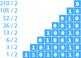
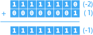

Les technologies de l’information consistent à stocker, traiter, et générer des données. On estime qu’en 2025, leur nombre atteindra 175 zettaoctets. Et à notre époque, certaines valent leur pesant d’or.

Pour être stockées, traitées, et générées par des machines, les données sont numérisées. C’est-à-dire que peu importe le type de leur valeur, elles seront toutes transformées en valeur numérique.

Mais ces valeurs numériques peuvent aussi s’exprimer de plusieurs façons, ce que l’on nomme des systèmes de numération.

# Système de numération

Certains systèmes de numération sont particulier, tel le système romain. Dans un contexte informatique, ayant comme principaux besoins de représenter et traiter de l’information par une machine, un système de numération plus adapté aux mathématiques et à l’électronique est nécessaire.

## Décimal

Le fait que nous ayons 10 doigts n'est probablement pas étranger au système décimal, système de numération additif à base 10. On nomme « chiffre » les 10 symboles de cette numération, généralement représentés par:

Le nombre décimal 123456 peut être décomposé de façon suivante:

Et puisqu'il s'agit d'un nombre à base 10, il peut être représenté de façon suivante:

## Binaire

La base de la logique informatique repose sur le système binaire, un système de numération à base 2. On nomme « bit » les 2 symboles de cette numération, généralement représentés par:

Et on nomme « octet » un groupe de 8 bits, qui consistent en l’unité de base en informatique:

L’utilisation de ce système, plutôt que le système décimal, s’explique par la facilité de représenter des données et effectuer des opérations avec l’électricité; puisque soit le courant passe (1), soit il ne passe pas (0).

### Conversions

Malgré ça base minimaliste, le fonctionnement du système binaire est équivalent à celui du système décimal:

La même logique peut donc être utilisée avec la base 2:

#### Décimal à Binaire

Plutôt que de multiplier par la base, c'est la division entière qui est utilisée pour effectuer la conversion. Le reste à cette division est ajouté au résultat, de droite à gauche, jusqu'à ce que le nombre entier décimal soit 0:

### Signe

Les valeurs entières étant représentées par le système binaire en mémoire centrale, celles-ci ne peuvent qu'être positives puisqu’il n’y a pas de signe dans ce système, que des 0 et des 1.

Le bit le plus fort est donc utilisé afin d'indiquer si la valeur est positive (0) ou négative (1). Mais cette façon de faire comporte des problématiques: il y a deux 0 (un positif et un négatif) et les résultats d'opérations arithmétiques ne sont plus valides lorsque des valeurs négatives sont impliquées:

#### Complément à deux

Pour pallier ces problèmes, le complément à deux est utilisé pour effectuer la négation, c'est-à-dire que tous les bits sont inversés, puis 1 est ajouté. Pour représenter la valeur négative -2, nous devons appliquer le complément à deux à la valeur 2:

Donc chaque fois que le bit le plus fort est 1, c'est que la valeur est négative et encodée avec le complément à deux:

### Plage

L'octet est l'unité de base en informatique, mais il est possible d'utiliser plusieurs octets de suite afin de représenter une valeur.

Pour connaître une plage de valeurs, il suffit d'utiliser la base 2 et de l'élever selon le nombre de bits:

&nbsp;*2***8** = 256, donc une plage de valeur entre **0** et **255** inclusivement. 
*2***16** = 65 536, donc une plage de valeur entre **0** et **65 535** inclusivement. 
*2***32** = 4 294 967 296, donc une plage de valeur entre **0** et **4 294 967 295** inclusivement. 
*2***64** = 18 446 744 073 709 551 616, donc une plage de valeur entre **0** et **18 446 744 073 709 551 615** inclusivement.

#### Signe

Les plages ci-hautes sont valides que pour des valeurs dites « non signées ». Puisque le bit le plus fort est utilisé pour les valeurs signées, la plage est donc affectée:

&nbsp;*2***7** = 128, donc une plage de valeur entre **-128** et **127** inclusivement. 
*2***15** = 32 768, donc une plage de valeur entre **-32 768** et **32 767** inclusivement. 
*2***31** = 2 147 483 648, donc une plage de valeur entre **-2 147 483 648** et **2 147 483 647** inclusivement. 
*2***63** = 9 223 372 036 854 775 808, donc une plage de valeur entre **-9 223 372 036 854 775 808** et **9 223 372 036 854 775 807** inclusivement.

## Hexadécimal

Ce système de numération est régulièrement utilisé en informatique afin de représenter de grandes valeurs de façon plus concise.

...
