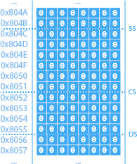
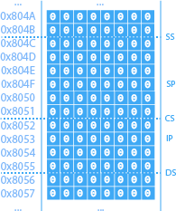

Unités système d'un ordinateur personnel.

# Architecture

Les deux architectures communes comportent les mêmes composantes et sont organisées de façon très similaire.

## Von Neumann

Plus lente et moins sécuritaire, cette architecture reste la plus utilisée puisqu'elle est plus simple, donc moins couteuse, et moins restraignante:

## Harvard

La principale différence avec l'architecture précédente est que les instructions et les données se trouvent dans deux mémoires distinctes:

# Mémoire centrale

La « RAM (Random Access Memory) », ou mémoire vive, est la « mémoire à court terme » de l'ordinateur et permet d'échanger des données très rapidement avec le processeur et les périphériques.

Chaque octet de la mémoire centrale est associé à une adresse, généralement exprimée en hexadécimal:

## Boutisme

En gros boutisme (big endian), les octets sont lus de gauche à droite, tandis qu'en petit boutisme (little endian), ils sont lus de droite à gauche.

Le gros boutisme est plus facilement lisible par la majorité de la population. Mais en petit boutisme, les données de 16, 32, 64, ... bits ont la même valeur, ce qui n'est pas le cas en gros boutisme. C'est pourquoi la majorité des processeurs rétrocompatibles utilisent le petit boutisme.

# Unité centrale de traitement

Le « CPU (Central Process Unit) », ou processeur, est le « cerveau » de l'ordinateur et son rôle est d'exécuter des opérations.

## Registres

Les registres sont des espaces mémoire particuliers auxquelles le processeur peut accéder directement, avec un très faible temps d'accès, puisqu'ils sont situés dans l'architecture interne du processeur.

Les registres sont impliqués dans la quasi-totalité des instructions que le processeur peut accomplir. Leur nombre est limité et leur taille est variable. 16 bits pour un processeur dit 16 bits, 32 bits pour un processeur dit 32 bits, 64 bits pour un processeur dit 64 bits, etc.

### Données

Parmi la quinzaine de registres qu'offrait le processeur 8086 d'Intel, 4 registres de 16 bits étaient disponibles pour usage courant. On nomme ces registres: AX, BX, CX et DX.

Les registres de données sont divisés en deux parties de 8 bits chacune: la partie haute et la partie basse. AH et AL composent AX, BH et BL composent BX, etc. « H » étant la partie haute (High) et « L » la partie basse (Low).

Avec la venue des processeurs 32 bits, ces registres ont été nommés EAX, EBX, ECX et EDX afin de conserver une rétrocompatibilité avec les processeurs 16 bits. On a fait de même avec l'arrivée des processeurs 64 bits en les nommant RAX, RBX, RCX et RDX:

Les registres de données peuvent être utilisés librement par le programmeur pour ses besoins, mais ils ont aussi un rôle spécifique pour certaines instructions.

- AX sert régulièrement d’accumulateur pour stocker le résultat ou passer un paramètre.
- BX sert régulièrement à gérer l’adressage indexé en mémoire centrale.
- CX sert régulièrement à gérer des structures itératives.
- DX sert à quelques instructions mathématiques.

### Segment

Parmi les autres registres, 4 servent à segmenter le mémoire centrale afin de déterminer où se trouvent les différentes parties d'un programme.

Le registre CS « Code Segment » identifie le segment de mémoire qui contient les instructions du programme, DS « Data Segment », le segment qui contient les données, et SS « Stack Segment », le segment de la pile:

### Pointeurs

Le registre IP « Instruction Pointer » contient l’adresse-mémoire de la prochaine instruction à exécuter par le processeur, et le registre SP « Stack Pointer » contient l’adresse-mémoire du dessus de la pile:

### Indicateurs

Le processeur a été conçu afin qu'il ne cesse jamais de fonctionner. Un mécanisme interne est donc nécessaire afin que le ou la programmeur puisse faire le suivi des opérations.

Un registre d'indicateurs « flags » est disponible à cet effet. Chacun de ses bits représente une particularité qui pourrait se produire suite à une opération.

- « OF (Overflow) » est vrai (1) s'il y a eu dépassement de capacité d'un registre lors de la dernière opération.
- « ZF (Zero Flag) » est vrai (1) si le résultat de la dernière opération est 0.
- « SF (Sign Flag) » est vrai (1) si le résultat de la dernière opération est négatif.
- « CF (Carry Flag) » est vrai (1) si le résultat de la dernière opération a une retenue.
- ...

## Instructions

L'ensemble des instructions (Instruction Set) consiste à toutes les opérations (Operation Code) qu'un processeur peut exécuter.

On distingue deux types d'architecture d'ensemble d'instructions:

### CISC

(Complex Instruction Set Computer) offre beaucoup d'instructions, mais plus couteux et moins rapide.

### RISC

(Reduce Instruction Set Computer) offre peu d'instructions, mais peu couteux et plus rapide.
