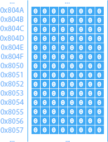
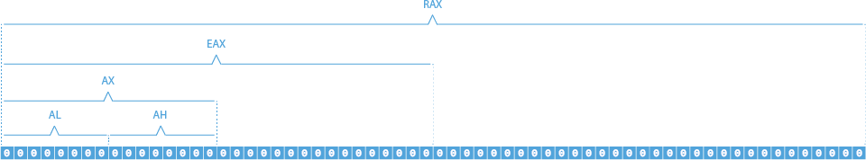

Unités système d'un ordinateur personnel.

# Architecture

Les deux architectures communes comportent les mêmes composantes et sont organisées de façon très similaire.

## Von Neumann

Plus lente et moins sécuritaire, cette architecture reste la plus utilisée puisqu'elle est plus simple, donc moins couteuse, et moins restraignante:

## Harvard

La principale différence avec l'architecture précédente est que les instructions et les données se trouvent dans deux mémoires distinctes:

# Mémoire centrale

La « RAM (Random Access Memory) », ou mémoire vive, est la « mémoire à court terme » de l'ordinateur et permet d'échanger des données très rapidement avec le processeur et les prériphériques.

Chaque octet de la mémoire centrale est associé à une adresse, généralement exprimée en hexadécimal:

## Boutisme

En gros boutisme (big endian), les octets sont lus de gauche à droite, tandis qu'en petit boutisme (little endian), ils sont lus de droite à gauche.

Le gros boutisme est plus facilement lisible par la majorité de la population. Mais en petit boutisme, les données de 16, 32, 64, ... bits ont la même valeur, ce qui n'est pas le cas en gros boutisme. C'est pourquoi la majorité des processeurs rétrocompatibles utilisent le petit boutisme.

# Unité centrale de traitement

Le « CPU (Central Process Unit) », ou processeur, est le « cerveau » de l'ordinateur et son rôle est d'exécuter des opérations.

*[Image]*

## Registres

Les registres sont des espaces mémoires particuliers auxquelles le processeur peut accéder directement, avec un très faible temps d'accès, puisqu'ils sont situés dans l'architecture interne du processeur.

Les registres sont impliqués dans la quasi-totalité des instructions que le processeur peut accomplir. Leur nombre est limité et leur taille est variable. 16 bits pour un processeur dit 16 bits, 32 bits pour un processeur dit 32 bits, 64 bits pour un processeur dit 64 bits, etc.:

## Instructions

...

### CISC

...

### RISC

...
