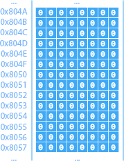

# Architecture

...

## Von Neumann

...

*[Image]*

## Harvard

...

*[Image]*

# Mémoire centrale

La « RAM (Random Access Memory) » est la mémoire à court terme de l'ordinateur et permet d'échanger des données très rapidement avec le processeur et les prériphériques.

Chaque octet de la mémoire centrale est associé à une adresse, généralement exprimée en hexadécimal:

## Boutisme

...

# Processeur

...

*[Image]*

## Registres

...

*[Image]*