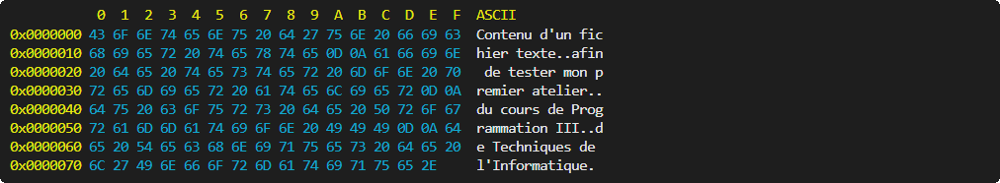

# Travail 1

Ce travail consiste à développer un programme, en ligne de commande, permettant d'afficher une suite de données d'un fichier.

## Fichier à accès aléatoire

Il sera nécessaire de manipuler des fichiers à accès aléatoire, et par conséquent, il faudra aussi gérer les exceptions qui pourraient se produire avec ceux-ci. Les classes ci-dessous doivent donc être importées:


Le constructeur de la classe « RandomAccessFile » permet d'ouvrir un fichier selon un mode, en lecture seule dans ce contexte:


Cette classe offre des méthodes afin de manipuler les données d'un fichier à accès aléatoire:

Méthode         | Description
----------------|-------------------------------------------------------------
void close()    | Fermeture de fichier.
long length()   | Obtention de la taille, en octets, du fichier.
int read()      | Obtention de l'octet à la position actuelle dans le fichier.
void seek(long) | Positionnement dans le fichier à l'octet passé en paramètre.

## Procédures

La procédure principale devra récupérer les arguments possibles :

- -o (facultatif, valeur par défaut : 0)
- -l (facultatif, valeur par défaut : taille du fichier - le décalage)
- -f (obligatoire)

Elle devra aussi les valider :

- La valeur du décalage (-o) doit être >= 0 et < que la taille du fichier.
- La valeur de la taille (-l) doit être > 0 et < que la taille du fichier - le décalage.
- La valeur du nom du fichier (-f) doit être valide.


Si les arguments sont valides et le fichier ouvert, la procédure « printData » doit être appelée afin d'afficher les données demandées :


Sinon, pour toutes exceptions ou mauvaise utilisation, la procédure « printUsage » doit être appelée afin d'afficher les indications d'utilisation :


## Arguments

Il est possible de passer des paramètres lors de l'exécution d'un programme, ce que l'on nomme des arguments. Sous l'éditeur « IntelliJ IDEA », les arguments peuvent être spécifiés en éditant la configuration de compilation:

*[Image]*

*[Image]*

La procédure principale comporte un paramètre « args », qui consiste en un tableau de chaînes de caractères, dans lequel sont stockés automatiquement les arguments passés au programme. Il serait possible de les afficher de cette façon:


## Exemples

À partir d'un fichier texte nommé « texte.txt » ayant comme contenu:

```
Contenu d'un fichier texte
afin de tester mon premier atelier
du cours de Programmation III
de Techniques de l'Informatique.
```

Le résultat avec l'argument « -f texte.txt » sera:



Le résultat avec les arguments « -o 75 -l 18 -f texte.txt » sera:

*[Image]*

Et le résultat avec les arguments « -o 98 -l 28 -f texte.txt » sera:

*[Image]*

*Il est à noter, dans la section ASCII, que les caractères de contrôle (les sauts de ligne par exemple) doivent être remplacés par le caractère « . ».*

### Affichage formatée

Plutôt que d'utiliser « println », la méthode « printf » permet de formater l'affichage.

```java
System.out.printf("Affichage formatée.\n");
```

**Consultez les documentations à son sujet, elle vous permettra de réduire de beaucoup les traitements nécessaires à l'affichage, et réduira considérablement le temps nécessaire à la réalisation de ce travail.**

### Couleurs

Il est possible, en ligne de commande, de modifier la couleur d'affichage des caractères à l'aide d'une balise spéciale:

```java
System.out.println("\u001B[33m Jaune");
System.out.println("\u001B[36m Cyan");
System.out.println("\u001B[37m Blanc");
```

## Défis

La visualisation des données brutes permet d'apprendre et comprendre comment elles sont interprétées, comment les programmes sont structurés afin d'être exécutés, et déduire certaines failles de sécurité possibles.

### Chaînes de caractères

Il est possible, à l'aide du programme développé dans cet atelier, de déterminer le mot de passe du programme «  ».

Un argument -s (facultatif, valeur par défaut : 4) pourrait permettre d'afficher les chaines de caractères du fichier, plutôt que ses données, selon la taille minimum passée en paramètre.

```java
public static void printStrings(byte minLength) {
  // TODO: Affichage des chaînes de caractères.
}
```

Par exemple, le résultat avec les arguments « -l 534 -f CrackMe1.exe -s » sera:

*[Image]*

*Il est à noter que dans l'exemple ci-haut, les caractères de contrôle des chaînes de caractères (le retour de chariot et le saut de ligne par exemple) sont remplacés par leur balise en programmation. Mais il est permis de les ignorer afin de réduire le temps de développement.*

### Format

Il est possible, à l'aide du programme développé dans cet atelier, de déterminer le système d'exploitation et le processeur cible des programmes « ProgrammeX.exe »:

- 
- 
- 
- 

Outre les fichiers texte, le contenu de fichiers binaires est, pour la grande majorité, structuré selon le type de contenu, ce que l'on nomme « format ». Dans le contexte de la programmation, ce sont principalement des fichiers exécutables qui sont produits, et, tout comme les autres, ceux-ci sont structurés selon un format particulier.

Un argument -i (facultatif, aucun paramètre) pourrait permettre d'afficher des informations sur un exécutable (et d'autres types si vous désirez).

```java
public static void printFormat() {
  // TODO: Affichage du format d'exécutable.
}
```

Par exemple, le résultat avec les arguments « -f ProgrammeA.exe -i » sera :

*[Image]*

*Il est à noter que le chapitre concernant le « boutisme » n'est pas à négliger pour les valeurs de certaines structures.*

## Barème

|Évaluation|Pondération|
|----------|:---------:|
|Gestion des arguments et paramètres|/ 2|
|Gestion du fichier|/ 2|
|Utilisation de « printf »|/ 1|
|Affichage des données|/ 5|
|Affichage des chaînes de caractères|/ 3|
|Affichage d'informations du format|/ 2|
| |**/ 15**|
